# 3016-CW2

# Video Link 

# Asset Usage
All 3d models and 2d assets used in this project do not belong to me and were downloaded from various sources on turbosquid, below is links to all 3d models used for this project. In the case of the wood texture, it was reused from the lab session
Note: some files included here did not end up in the final project, but they do still exist in the files
Butterfly: https://www.turbosquid.com/3d-models/butterfly-fly-3d-obj/460590
Large tree: https://www.turbosquid.com/3d-models/3d-fairy-tree-model-1981463
Rock:https://www.turbosquid.com/3d-models/rock07base3ds-3d-1899446
Tree:https://www.turbosquid.com/3d-models/gentree-103-generic-tree-103-3d-model-2062798
WinterTree: https://www.turbosquid.com/3d-models/3d-oak-winter-4-tree-model-1384368
wood texture: Lab session

# Gameplay description 
The gameplay is relatively simple, as the project is mostly focused on the scene itself rather than what you can do in the scene. However it does still contain some notable gameplay elements.
A key element of this was players ability to move around the scene using key inputs. These are done with a WASD control scheme, where w moves forwards, S moves backwards, A moves left and D moves right. This Control scheme was chosen as it is common in many games of this nature meaning it would be quick for players to pick up and understand 

# Dependencies used 
A variety of dependencies were used to complete this project, all repositories referenced are located in side the repository within the library folder within the project. Details about each dependency can be seen below 
## Open gl
Open gl was the core dependency the entire project was built around, basically the entire project would not be possible without the inclusion of the openGL library. 
In short, all the visuals come from OpenGL, and many of the other dependencies mentioned  use this one as a base(GLFW,GLAD). A key example of where this was absolutely vital to the code is seen in the render loop itself where the ‘glDawElements’ function was called. This function was used to draw the geometry of different objects in the scene and without it, essentially nothing of note would have been displayed. 

An example can be seen below
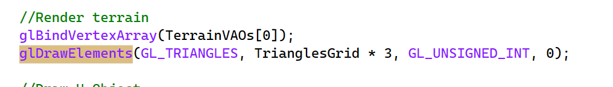
## GLM
GLM (Open gl mathematics) is a math library, which allowed for use of a variety of required mathematical features. While some of the features included with GLM could be coded manually without it (e.g 3 indiviual floats,or a length 3 array being used instead of a vec3), the entire scene would have been significantly harder to code, both in terms of the amount of code required and in terms of ease of understanding what the mathemtatics are doing.
Some key sections that GLM was used for were setting positions of models, setting the camera positions /moving the camera, and any other functions that require positioning/repositioning. Below is the code used to set the position of the central objects which is almost entirely made up of GLM originated code
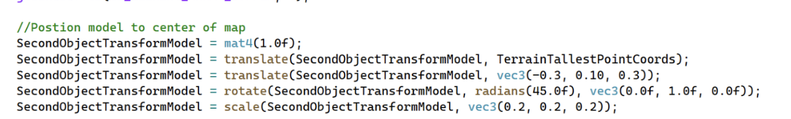
## ASSIMP/Learn Open GL
Assimp was used for a very simple but important reason, it enabled the program to retrieve/load a model from a file. Without this, it would not have been possible to load the models needed to display the intended scene. However, assimp cannot complete the full process for displaying a model, as it is unable to construct a model after it has been loaded. For this task the Learn Open Gl model construction libraries were used. It will take the loaded model data from the intended model file and construct it to be a model that can be displayed 
This can be seen in the code, when models are loaded, essentially ASSIMP is loading the obj file and then learning open gl is converting it to usable open gl data.
An example of this can be seen below where both models and shaders are loaded
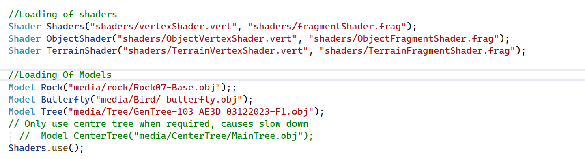
## Glad 
While open GLs libraries are very effective, they cannot be used effectively without the help of a tool to help them be loaded. Glad is used for this purpose, as it manages the function pointers needed in OpenGL.
While GLAD is only seen once in the code (when it is initially loaded) it is actually used all throughout the code, as without it , the required function pointers would not be possible to load and thus the open gl library would be essentially useless 
## Fast Noise Lite
Fast noise lite was used to generate the terrain used in the scene. This was very important to the scene as without it, the scene would either be a set of floating models or a model for the terrain itself would need to be made. Terrain was set up by first specifying the type of noise the terrain should use. In this case perlin noise was used to allow for random terrain to be generated while still looking like terrain that could realistically exist. With the terrain noise specified, the terrain vertices are generated, aswell as setting any biome noise to allow for a varied look in the terrain. 
With terrain now set up it is now rendered alongside everything else in the render loop
Below is an example of this being used, where the nosie type is specified.
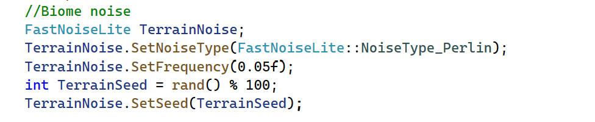

# Game programming patterns
## Game Loop
The core of the scene is built using the game loop programming pattern, essentially having everything rendered repeatedly inside a while loop which continues until the scene is exited/closed. Every iteration of the loop, the program will check for any user inputs, in the case of this scene, it checks for W,A,S,D key clicks as mouse movement. 
When it detects a key input, the relevant changes are made to data in the scene, with WASD being used for movement and the mouse being used to change the direction of the camera. Then on the next frame/loop iteration, the scene being displayed will be re rendered to reflect the changes .
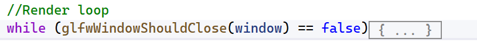
## Dirty flag
While the game loop method is very effective for drawing and rendering the scene, it does contain some drawbacks. Notably in regards to performance. This can cause an issue when the scene starts to get more complex, as rendering many objects every single frame will inevitably cause the scene to slow down. Therefore the game incorparetes a boolean flag, where expensice items in the scene are only rendered if something occurs to justify it (e.g a mouse movement or wasd click)
Below is the check done in the render loop and an example of where the flag is updated in the input detection function
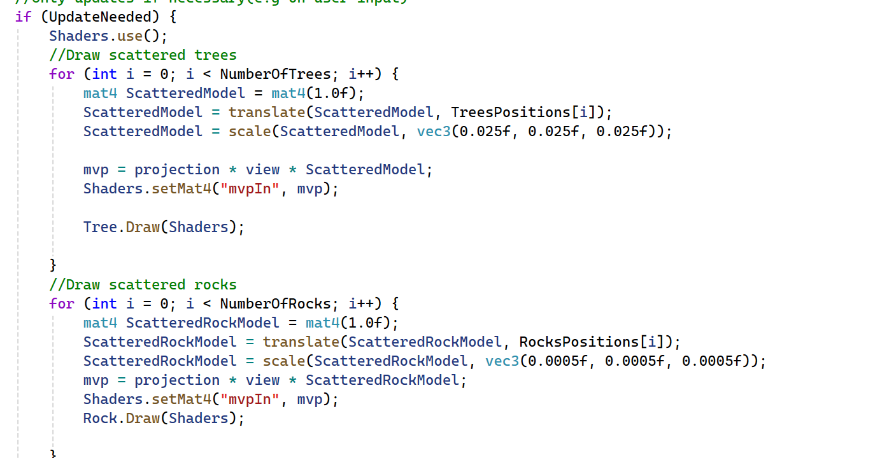
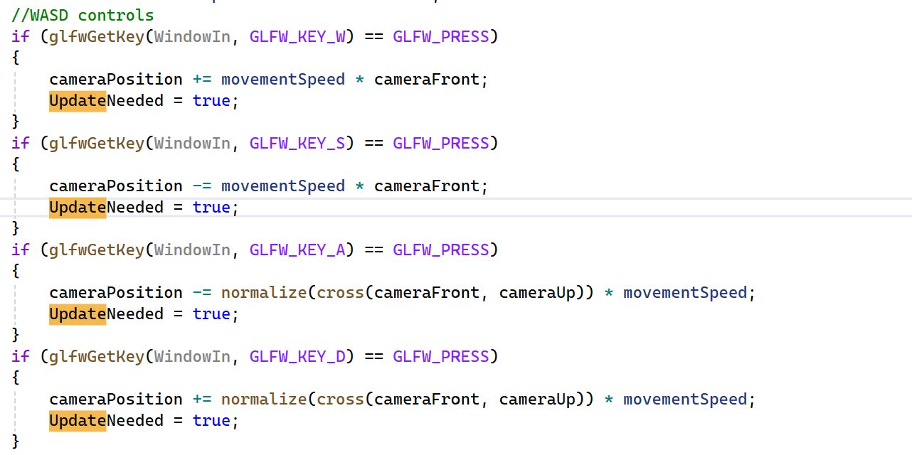
## Command pattern
The scene also contains a command pattern. In the game loop, 2 functions are called. One will check for any key inputs,and the other will check for mouse inputs. The code will check for what was inputted and adjust the game state accordingly, with WASD moving the position of the player and the mouse being used to move the direction the camera is looking
# Sample Screens
## Exception handling
To ensure the user was able to see as much of the scene as possible. Movement was implemented, which allowed both moving position and changing the way the camera is looking. 
To make sure the user did not simply go through the ground to an empty scene below, a check was added to make sure the camera's height position could not go lower than the terrain at the position the current user was at. Whenever a user would move the camera, the scene would check that their position was not low enough to be going through terrain and if they had in fact gone below the current position's terrain, the camera's Y positioning would be set to be above it.
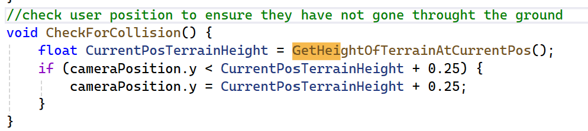
This came with a key exception to handle as if the user went out of bounds of the terrain, the code would attempt to check the terrains current position, and when it couldnt find it, a crash would occur. Therefore a check had to be added

(Note: this function was created with the assistance of AI, for more details see the AI statement later in this file)
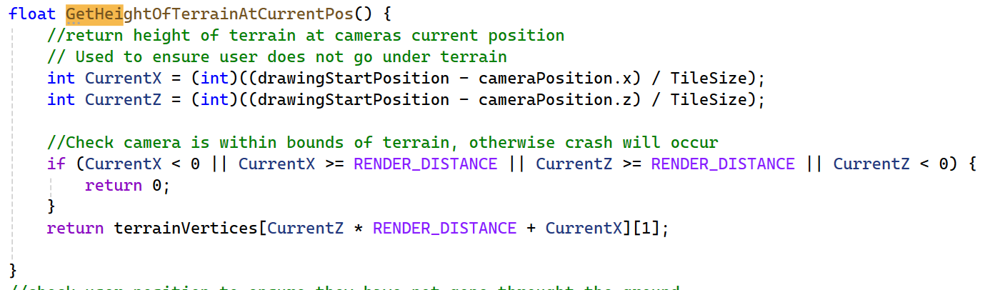 
Essentially, the cameras x and y position were converted into what tile the user is currently in, and if it was more than the maximum or less than 0, a 0 value would be returned, preventing the code from causing an error when not within the bounds of the terrain
## Initialisation 
There were a few instances within the code where something had to be initialised before it could be used (e.g features from libraries or assets). In these cases, a check was done to ensure nothing went wrong during this initialisation that would cause an error. For these cases, a check was done, and if it failed then the code would exit cleanly. If it did not exit cleanly and instead tried to continue, a full on crash would occur instead. 

Below are a few examples 
GLFW window initilasation: 
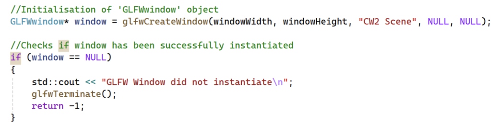 
GLad initialisation: 
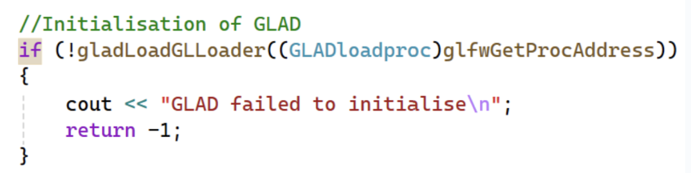 
Texture asset loading:
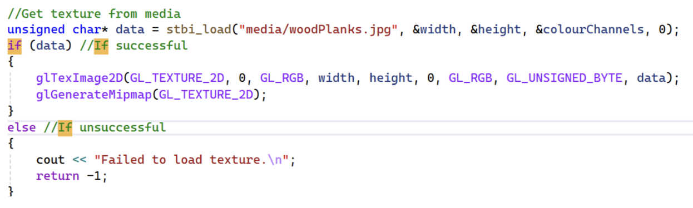 

# Extra things of note 
## Signature
Placed within the scenel,there are 2 objects,one being a H and one being a W. These act as a signature for myself, being my initials, for more details on these objects, please see the set up section below
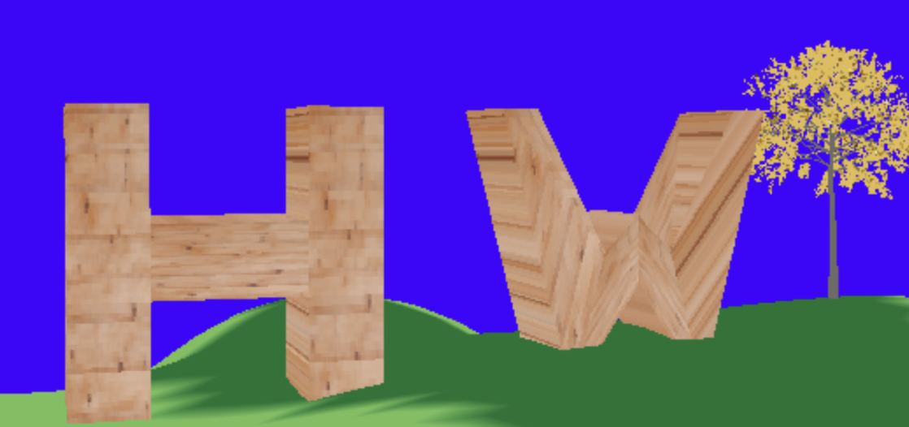 
## Setting up objects 
As mentioned in the above signature section, within the scene there are 2 objects, one being a H and one being a W. Unlile the trees and other objects seen around the scene, these were created by hard coding their vertices and indices in to the desired shapes.
To assist with the setup of these objects, rough diagrams were created. These diagrams were not completely final, but were helpful for visualising the coordinates needed for the indices/vertices.
A few changes did occur between the rough images and the final version, for exampple the H shaped object had some positioning changed around, thinning down the side parts. But overall these were still very important to the initial visualisation of positioning and drawing using the indices
These diagrams can be seen below or within the repository
### Vertices diagrams 
 
### Indices diagrams
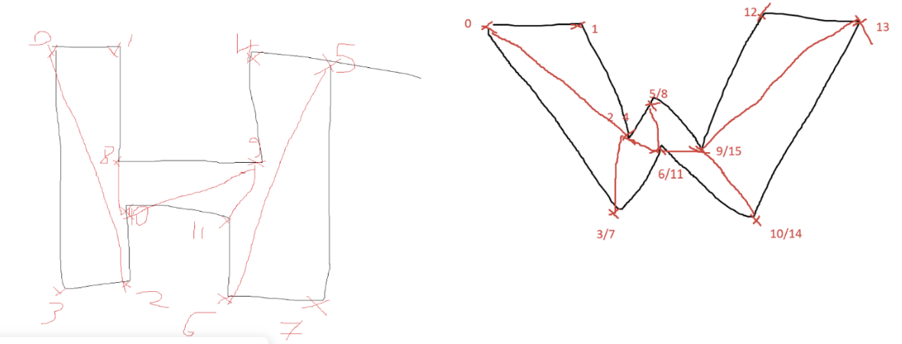 

## Dynamic placement/positioning of scenery
Around the scene, there are a variety of scenery objects(for example trees). These objects indiviually were nothing of note and were not a focus of the scene. But together come together to make the scene much more interesting.
When setting this up, I decided to program it to be dynamic to allow for tinkering so that I could choose how populated I wanted the scene to be. The end result of this was an integer for each object type which can be easily changed before running the code
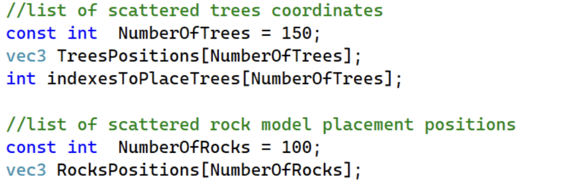  
When the code runs, before the scene is displayed, but after the terrain is set up. A loop will run, with an amount of iterations equal to the amount of objects declared. Each iteration will set the position for one of the tree/rocks positions (occuring in separate loops). The trees/rocks will be placed by taking coordinates from terrain vertices. This ensures that the items will be attached to the terrain, making them look believable in their placements. 

To ensure that object placements dont get bunched up in one spot, the code will equally space them apart by selecting vertex positions with indexes evenly spaced apart in the array . By doing this instead of random selection, it ensures that there is a good coverage of items across the terrain. Initially this solution worked to have good object coverage/spread, but the way indexes were perfectly spread apart did lead to objects being placed too evenly, to the point it looks unnaturaul 
Below is an example of the terrain with the even spacing, where you can see it looks like a pattern rather than a natually occuring set of trees 
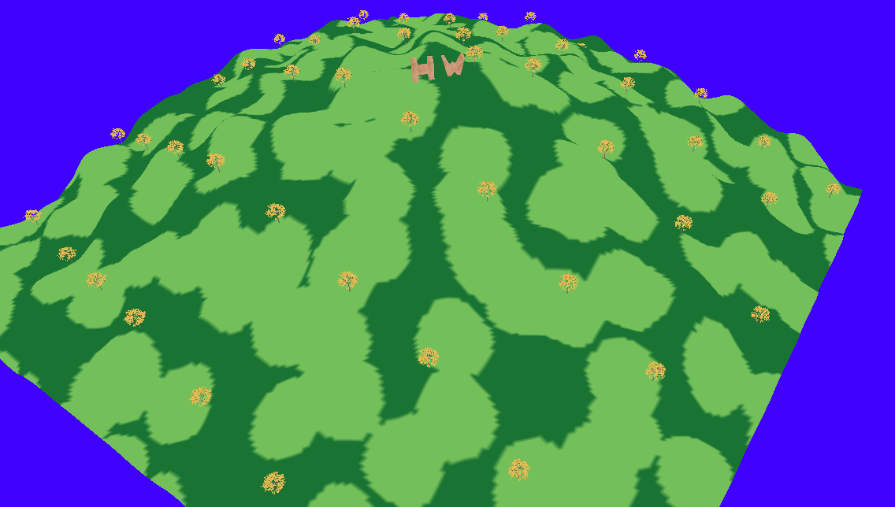  
To fix this, an integer for variance was added ,making sure items werent spaced perfectly evenly.The potential variance came from a random value, that could be anywhere between the non varied previous index and the non varied next index. So for example, if the highest index in the vertex array was 100, and there was going to be 20 trees(difference of 5 between on varied indexes), the variance for the second item would be between 0 and 10.
(Note: The idea to use this method for adding the extra variance was suggested by AI when asked about how to make the trees appear in a less uniform pattern)
Below is the code used to set up the tree positions:
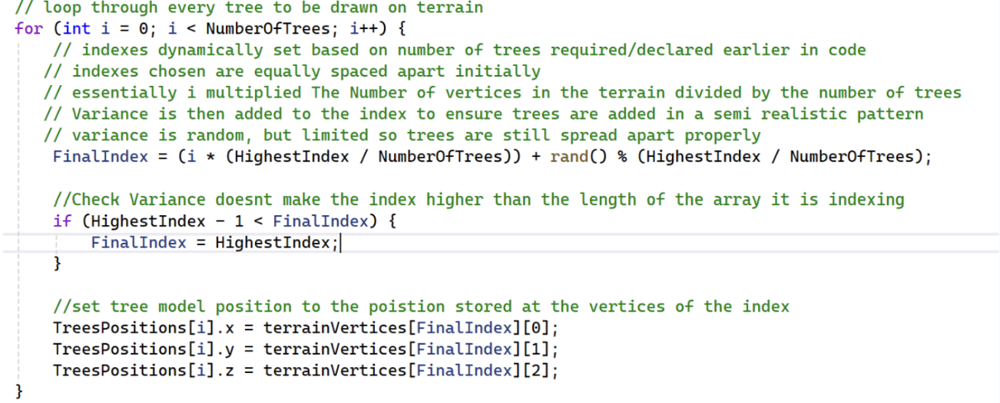 
The end result was the objects being spread across the map with good coverage but without looking like a pattern
Below an example of how the amount of tress can change the look of the scene can be seen:
250 trees:
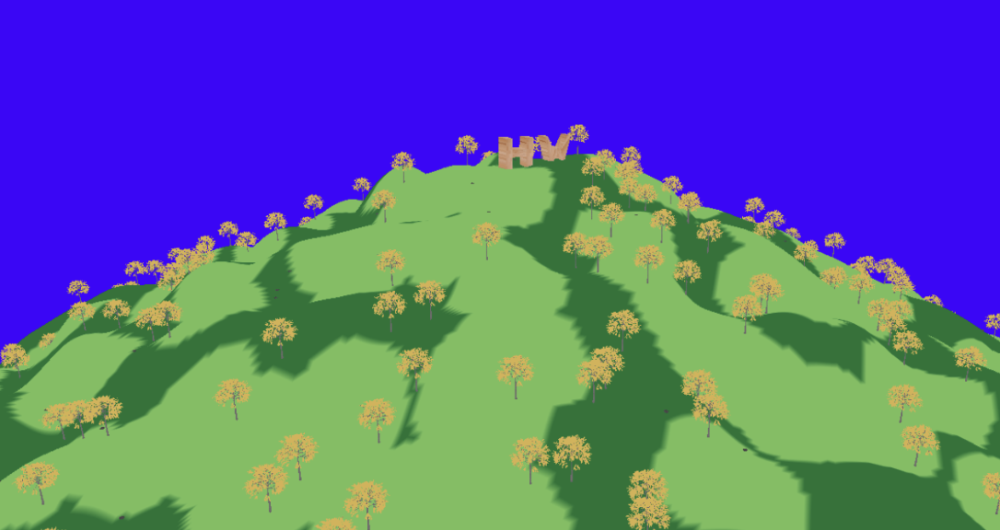  
50 trees:
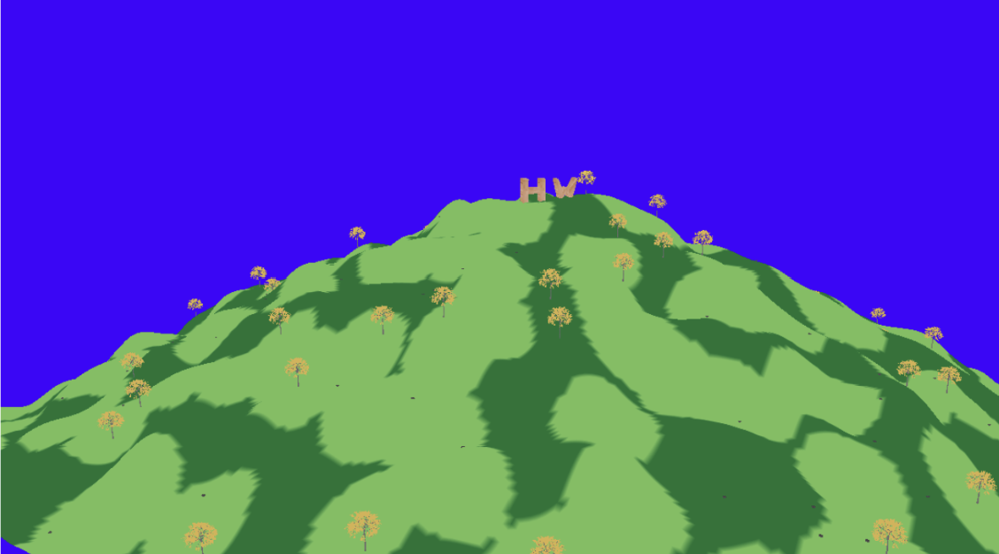  

## Use of AI statement 
An important thing to note for this project was that Generative AI was used in a partnered role throughout different parts of the project.
The main way it was used was as a coding assistant, which included a few different things. Most prominenelty, it was used for debugging, when a situation arose where looking over the code did not reveal where the issue is and a more thorough and timely debugging process was required, AI was used to diagnose the issue and suggest repairs, which saved valuable time. One example of where this was done was when a model was added in and it was appearing with no textures. After some back and forth where I confirmed that the file path was correct, it suggested adding a seperate shader for the models, and this ended up working.
In addition, it was used to assist with some bits of code where initally I was unsure how to approach it. A key example of this was quite early on, where I was unsure how to convert the hilly terrain from labs into one central big hill. The AI showed me a few edits to be made to generate a single, taller hill(as opposed to multiple smaller ones). With that part done, and with an understanding of how it now worked, I was able to fine tune it to exactly what I wanted, changing the the height/steepness as well as editing the size of the terrain until I was satisfied with the hill shape
Another example of where it was used as an assisting role was when I was writing the code for checking that a user does not go beneath the terrain. For this I was not sure how to make a comparison between the position of the terrain and the real world position of the user, as this was needed to get the height of the terrain where the camera was. In this case,AI showed how to convert the real world position of the camera to a value relative to the positioning of the terrain and also suggested some small refinements to the function for getting the terrain height as a whole.
Another place where AI was used was for making the gitignore. As it was the first time I was using open gl, I was not sure of exactly what to ignore so AI helped for this purpose.
Overall AI was a helpful tool for the work done here, and while it is not a perfect tool,it was still able to save lots of time debugging, and was also very useful for tricky bits of code which would have taken valuable programming time for other features to figure out 
# Evaluation 
Overall I believe that, while far from perfect, I have created a scene with a fair amount going on. The implementation of a dynamic system for distributing items around the map is definitely a highlight in my opinion, as it allows for lots of tinkering in terms of getting the scene correct without having to spend unnecessary time hard coding, and overall, I think the aesthetic of trees on a hill is rather nice. 
I do however feel like the scene falls somewhat short in places, as there is not a massive amount going on in this scene at the top of the hill, where I wanted something interesting to be. With more time I wanted to implement a much more interesting scene at the top of the hill, preferably, with enough time I would have created a scene of a garden. But in the end it just became a place to leave the singature objects. If I could do this again I would spend more time getting a nice scene going there before filling the rest of the map

